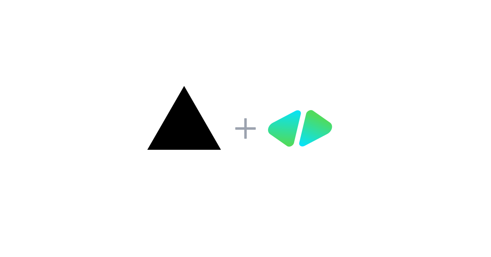

# HyperFrames on Cloudflare — TanStack Start + TanStack AI

[](https://deploy.workers.cloudflare.com/?url=https://github.com/heygen-com/hyperframes-cloudflare-template)



<!-- dash-content-start -->

A [HyperFrames](https://github.com/heygen-com/hyperframes) template built with [TanStack Start](https://tanstack.com/start) that previews HTML video compositions in the browser and renders MP4s server-side using a [Cloudflare Container](https://developers.cloudflare.com/containers/) (Chromium + FFmpeg) and stores them in [R2](https://developers.cloudflare.com/r2/). AI generation streams through [TanStack AI](https://tanstack.com/ai) with the official OpenRouter adapter.

Demonstrates TanStack Start server routes on Workers (via the Cloudflare Vite plugin), a custom server entry exporting a Container Durable Object, streaming response bodies into R2, and BYOK AI generation over Server-Sent Events with `useChat`.

<!-- dash-content-end -->

Deploying provisions a Worker, the `RenderContainer` Durable Object, and an R2 bucket (`hyperframes-renders`). Cloudflare Containers requires a [Workers Paid](https://developers.cloudflare.com/workers/platform/pricing/) plan.

## What this template does

- **Preview** a bundled composition (`cloudflare-intro`) in the browser using `<hyperframes-player>`, the zero-dependency web component from `@hyperframes/player`.
- **Render** the composition to an MP4 by POSTing to `/api/render`. The server route streams the composition to a Cloudflare Container running a pre-built image with Chromium + FFmpeg + HyperFrames, streams the rendered MP4 directly into R2, and returns a URL.
- **Generate from a prompt (BYOK)** — log in with OpenRouter (OAuth PKCE, or paste an API key) and type a text prompt; the `/api/generate` route runs [TanStack AI's `chat()`](https://tanstack.com/ai) with the OpenRouter adapter (Gemini 3 Flash by default) and streams the composition to the browser over SSE as it's written. The client lints the result with `@hyperframes/core/lint` via a server function and self-heals up to 2× as follow-up chat turns, then previews it in the player. Click "Render MP4" to capture it. See [AI generation](#ai-generation-byok).

**Authoring happens locally.** This template ships with one pre-authored composition. To build your own, use the HyperFrames CLI on your machine:

```bash
npx hyperframes init my-video
cd my-video
npx hyperframes preview   # live-reload editor in your browser
```

Then swap it into this template (see [Swapping the composition](#swapping-the-composition) below).

## Architecture

```
 Browser                          Worker (TanStack Start)             Container DO (instance_type: standard-4)
┌─────────────────────┐          ┌────────────────────────┐          ┌──────────────────────────────────┐
│ React UI (routes/)  │  ─────▶  │ /api/render            │  ─────▶  │ Node HTTP server (port 8080)     │
│ <hyperframes-       │          │  - load files from     │          │  - writes files to /tmp/         │
│  player> iframe     │          │    ASSETS              │          │  - hyperframes render            │
│                     │          │  - POST → container    │          │    (Chromium + ffmpeg)           │
│ useChat (TanStack   │  ◀────   │  - stream → R2 bucket  │  ◀─────  │  - streams mp4 in response       │
│  AI) — SSE stream   │   url    │  - return /r/<key>     │    mp4   │                                  │
└─────────────────────┘          ├────────────────────────┤          └──────────────────────────────────┘
                                 │ /api/generate          │
                                 │  - chat() + OpenRouter │ ─▶ openrouter.ai (BYOK, SSE back to browser)
                                 │ lintComposition()      │
                                 │  - server function     │
                                 └────────────────────────┘
                                        │
                                        ├─▶ R2 (hyperframes-renders)
                                        └─▶ ASSETS (client build, preview HTML, composition files)
```

The Worker entry is `src/server.ts` — TanStack Start's fetch handler plus the `RenderContainer` Durable Object export, which wrangler requires to live on the `main` module.

### The container image

Cold-start of a render container is faster than installing dependencies on every request because the renderer is **baked into the image** at build time, not installed at runtime:

1. `node:22-bookworm-slim` base
2. `apt-get install` Chromium system libs (`libnss3`, `libxcomposite1`, `pango`, …)
3. `npm install hyperframes ffmpeg-static`
4. Symlink `ffmpeg-static/ffmpeg` to `/usr/local/bin/ffmpeg`
5. `npx hyperframes browser ensure` to download `chrome-headless-shell`
6. Copy `container/server.mjs` (a small Node HTTP server) and `CMD ["node", "server.mjs"]`

At render time, the server route sends composition files in the request body, the container writes them to a tmp dir, runs `hyperframes render`, and streams the MP4 back. Container instances sleep after 10 minutes of inactivity (`sleepAfter` on the Container class).

### Why Cloudflare Containers (and not Browser Rendering)

Cloudflare's [Browser Rendering](https://developers.cloudflare.com/browser-rendering/) is a hosted Chromium API — great for screenshots and PDFs, but you can't install FFmpeg into it. HyperFrames needs full control of the Chromium process plus an FFmpeg binary on the same filesystem, which is exactly what [Cloudflare Containers](https://developers.cloudflare.com/containers/) gives you: an OCI container in a Worker-bound Durable Object, with up to 4 vCPUs and 12 GiB of RAM on `standard-4`.

With 4 vCPUs, `hyperframes render --workers auto` launches 3 parallel Chrome workers, cutting the render time roughly 2× vs. the single-worker default.

## Local development

```bash
bun install
bun run dev
```

`bun run dev` regenerates the composition manifest/preview bundle (`scripts/build.mjs`) and starts Vite on port 3000. The [Cloudflare Vite plugin](https://developers.cloudflare.com/workers/vite-plugin/) runs the Worker runtime locally, including building + running the render container against your local Docker daemon (Docker is required for local container dev). The browser preview works without Docker; only `/api/render` needs the container.

### Checks

```bash
bun run typecheck   # tsc --noEmit
bun run test        # vitest
bun run lint        # oxlint
bun run format      # oxfmt (use format:check in CI)
```

CI runs all of these plus a production build. `package.json` and `wrangler.jsonc`
are excluded from the formatter on purpose — see the note in `.prettierignore`.

### Testing the render container in isolation

If you want to iterate on the `Dockerfile` or `container/server.mjs` without booting the dev server, you can hit the container directly:

```bash
docker build -t hf-render .
docker run -d --rm --name hf-test -p 18080:8080 hf-render
node scripts/test-render.mjs 18080 /tmp/out.mp4
docker stop hf-test
```

The script reads `src/composition-manifest.json`, base64-encodes the composition files, POSTs them to the container, and writes the MP4 it returns. The bundled 9s composition renders in ~17s on a 6-vCPU host.

## Project structure

```
src/
  server.ts                   # Worker entry — Start fetch handler + RenderContainer export
  container.ts                # RenderContainer Durable Object
  router.tsx                  # TanStack Router setup
  composition-manifest.json   # Generated by scripts/build.mjs
  routes/
    __root.tsx                # Document shell (loads /_hyperframes/player.js)
    index.tsx                 # Preview UI page
    r.$.ts                    # GET /r/<key> — serve MP4s from R2
    api/
      render.ts               # POST /api/render — composition → container → R2
      preview.ts              # GET /api/preview — bundled preview HTML
      generate.ts             # POST /api/generate — TanStack AI chat() + OpenRouter (SSE)
  components/
    Player.tsx                # <hyperframes-player> wrapper
    AiPanel.tsx               # BYOK prompt panel — useChat + lint/self-heal loop
    RenderControls.tsx        # Render MP4 button + reset
  lib/
    generation.ts             # Shared client/server generation helpers
    server-fns.ts             # Server functions: getAppConfig, lintComposition
    hyperframes-skill.ts      # System + task prompts for composition generation
    server/                   # Server-only helpers (assets, lint)
container/
  server.mjs                  # Node HTTP server inside the container
  package.json                # Container deps (hyperframes + ffmpeg-static)
public/
  compositions/
    cloudflare-intro/         # The bundled example composition
scripts/
  build.mjs                   # Manifest + preview bundle + player.js copy (runs before dev/build)
  bundle-preview.ts           # Bundles composition into single HTML via @hyperframes/core
  test-render.mjs             # Local container E2E
Dockerfile                    # Render container image
vite.config.ts                # Cloudflare plugin + TanStack Start + React
wrangler.jsonc                # Worker + Container + R2 bindings (main: src/server.ts)
```

## Swapping the composition

1. Drop your composition bundle into `public/compositions/<your-name>/`.
2. Set `PREVIEW_COMPOSITION_DIR` env var when running build/deploy:
   ```bash
   PREVIEW_COMPOSITION_DIR=compositions/<your-name> bun run deploy
   ```
   Or edit the default in `scripts/build.mjs` (line 9).
3. Optionally update the player dimensions in `src/components/Player.tsx` if your composition isn't 1920×1080.
4. Re-run `bun run dev` or `bun run deploy` — `scripts/build.mjs` regenerates the manifest and bundle.

## AI generation (BYOK)

The "Generate from a prompt" panel lets a viewer log in with their own OpenRouter account (OAuth PKCE — or paste an API key manually), type a description, and synthesize a HyperFrames composition end-to-end — watching it stream in live. The composition previews in the player; the Render button then captures it to MP4 just like the bundled one.

Built on [TanStack AI](https://tanstack.com/ai): `chat()` + `@tanstack/ai-openrouter` on the server, `useChat` from `@tanstack/ai-react` on the client, wired over Server-Sent Events.

### Enabling it

It's already on for self-deployers — `wrangler.jsonc` sets `ENABLE_AI_GEN: "true"` in `vars`. Set it to `"false"` if you're hosting a public demo: that disables both `/api/generate` and rendering custom HTML through `/api/render`, so visitors can only render the bundled composition on your account.

### How the API key is handled

- **Login (default):** "Log in with OpenRouter" runs [OpenRouter's OAuth PKCE flow](https://openrouter.ai/docs/use-cases/oauth-pkce) entirely in the browser (`src/lib/openrouter-oauth.ts`) — redirect to `openrouter.ai/auth`, then exchange the one-time code client-side for a runtime API key scoped to this app (revocable from the OpenRouter dashboard). No client secret; the key never touches the Worker outside of generate requests. The PKCE code verifier sits in `sessionStorage` only across the redirect and is deleted on return, before any generated composition can run.
- **Manual (fallback):** the user can still paste a key into the panel instead.
- Either way the key is sent in the `forwardedProps` field of each `POST /api/generate` request body (the client uses a custom `useChat` fetcher, so every request carries the current key).
- The server route constructs a per-request OpenRouter adapter with the key; TanStack AI forwards it to `openrouter.ai` as `Authorization: Bearer <key>`.
- The Worker does not log, cache, or persist the key. It exists only for the duration of one request.
- Client-side, the key is held in React state only — never in `sessionStorage` or `localStorage`. Generated compositions execute in the player's iframe with same-origin access, so origin-readable storage would expose the key to model-generated code. Keeping it out of storage removes that trivial read, but it is not an isolation boundary — same-origin generated code can still reach `window.parent` and recover the key from app state, so assume a determined composition can read it. The real blast-radius control is the key itself: use a disposable, spend-capped key and revoke it from the OpenRouter dashboard when done. A reload clears it from the browser.

### Pipeline

```
prompt + key
   │
   ▼
useChat fetcher ─▶ POST /api/generate            (server route)
   │                  │
   │                  ├─▶ systemPrompts: hyperframes skill (src/lib/hyperframes-skill.ts)
   │                  ├─▶ chat() + createOpenRouterText(model, key)   (Gemini 3 Flash default)
   │                  └─▶ SSE stream back to the browser (composition streams in live)
   │
   ├─▶ onFinish: extract HTML → lintComposition()   (server function, @hyperframes/core/lint)
   ├─▶ lint errors? send a fix message as the next chat turn (≤2 retries, temp 0.3)
   └─▶ clean (or out of retries): player.setAttribute("srcdoc", html)

POST /api/render { html }               (existing endpoint, accepts inline HTML)
   │
   └─▶ container → MP4 → R2 → /r/<key>
```

The default model is `google/gemini-3-flash-preview` — cheapest and fastest direct generation per ~80 eval runs in [llm-stories-hyperframes](https://github.com/jrusso1020/llm-stories-hyperframes), which the prompt is adapted from. You can pass a different `model` in `forwardedProps` to swap in any [OpenRouter model](https://openrouter.ai/models), and a `durationSec` number to change the target composition length.

## Pricing

[Cloudflare Containers pricing](https://developers.cloudflare.com/containers/pricing/) — pay-per-10ms for memory, CPU, and disk. A 70-second render on `standard-4` (4 vCPU, 12 GiB) costs ~$0.008. R2 storage is $0.015/GB-month with no egress fees within Cloudflare's network.

## License

[Apache-2.0](./LICENSE) — same license as HyperFrames itself.

## Links

- [HyperFrames repo](https://github.com/heygen-com/hyperframes)
- [HyperFrames docs](https://hyperframes.heygen.com)
- [TanStack Start docs](https://tanstack.com/start)
- [TanStack AI docs](https://tanstack.com/ai)
- [Cloudflare Containers docs](https://developers.cloudflare.com/containers/)
- [Cloudflare R2 docs](https://developers.cloudflare.com/r2/)
